<!-- PROFILE README — repo dyntr/dyntr. Hero + footer jsou vlastní animovaná SVG v assets/ (žádná závislost na externích službách). -->

  

  
  
  
  

---

### 👋 About &nbsp;·&nbsp; O mně

**EN** — I'm a full-stack developer from Prague who ships **real products end-to-end** — from the
first line of code to production and paying users. My work spans **AI-native software**,
**e-commerce platforms**, **native macOS/iOS apps** and **autonomous AI agents**. I like taking
an idea and turning it into something people actually use.

**CZ** — Jsem full-stack vývojář z Prahy a stavím **reálné produkty od začátku do konce** — od
prvního řádku kódu až po produkci a platící uživatele. Věnuju se **AI softwaru**, **e-commerce
platformám**, **nativním macOS/iOS appkám** a **autonomním AI agentům**. Baví mě vzít nápad a
udělat z něj věc, kterou lidi opravdu používají.

- 🧠 AI-native tools & autonomous agents — LLM orchestration, MCP, agent OS
- 🛒 Shipping & running live e-commerce — Shopify, custom storefronts
- 🖥️ Native macOS & iOS apps in Swift / SwiftUI
- 🌐 Freelance full-stack web — Next.js, React, Cloudflare
- 📚 Studying at **SPŠE Ječná**, Prague

---

### 🚀 What I'm building &nbsp;·&nbsp; Na čem pracuju

<table>
<tr>
<td width="50%" valign="top">

**🛒 [Vendaro](https://github.com/dyntr/Vendaro)**
European AI-commerce platform — turn a photo into a live store, marketplace & AI-discoverability layer.
`Next.js 15` · `Supabase` · `Claude API`

</td>
<td width="50%" valign="top">

**🧭 88 Leads CRM** &nbsp;`private`
Production CRM & invoicing — lead pipeline, e-mail automation, affiliate module, client portal.
`TypeScript` · `React` · `SQLite`

</td>
</tr>
<tr>
<td width="50%" valign="top">

**🤖 Jarvis OS** &nbsp;`private`
A personal "second-brain" operating system — native dashboard, voice chat & a 24/7 agent engine.
`Swift` · `SwiftUI` · `Python`

</td>
<td width="50%" valign="top">

**🛡️ [Sentinel](https://github.com/dyntr/Sentinel)**
Native macOS security auditor — SIP, FileVault, firewall, open ports & process inspection.
`Swift` · `SwiftUI` · `AppKit`

</td>
</tr>
<tr>
<td width="50%" valign="top">

**🎬 Reelify** &nbsp;`private`
AI video editor for short-form — auto-cuts, karaoke captions, SFX & brand kits.
`Next.js` · `Remotion`

</td>
<td width="50%" valign="top">

**🔧 parts4cars** &nbsp;`commercial`
Live auto-parts e-commerce I build & run — Shopify storefront, catalog sync & automation.
`Shopify` · `Liquid` · `Node.js`

</td>
</tr>
</table>

Also building · Dále stavím: **[Vlna](https://github.com/dyntr/Vlna)** (native bulk-SMS app) · **[Pulse](https://github.com/dyntr/Pulse)** (macOS menu-bar monitor) · **[AuraWidgetStudio](https://github.com/dyntr/AuraWidgetStudio)** (iOS widget studio) · **[EbookForge](https://github.com/dyntr/EbookForge)** · **[NicheCart](https://github.com/dyntr/NicheCart)**

---

### 🛠 Tech I work with &nbsp;·&nbsp; S čím pracuju

---

### 🐍 Contributions

<picture>
  <source media="(prefers-color-scheme: dark)" srcset="https://raw.githubusercontent.com/dyntr/dyntr/output/github-snake-dark.svg">
  <source media="(prefers-color-scheme: light)" srcset="https://raw.githubusercontent.com/dyntr/dyntr/output/github-snake.svg">
  
</picture>

---

### 📫 Get in touch &nbsp;·&nbsp; Ozvi se

  

